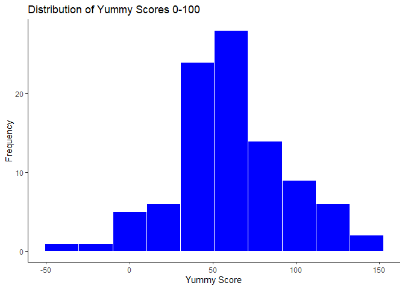
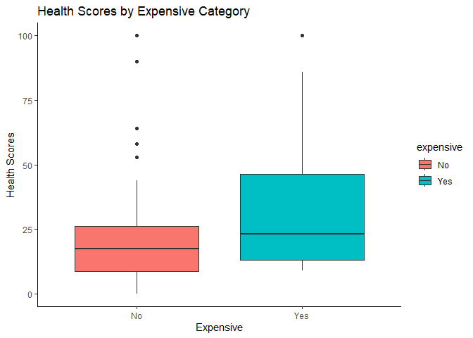
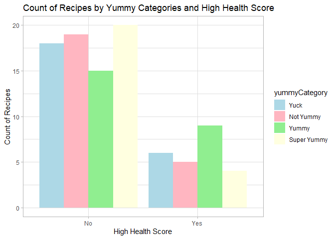
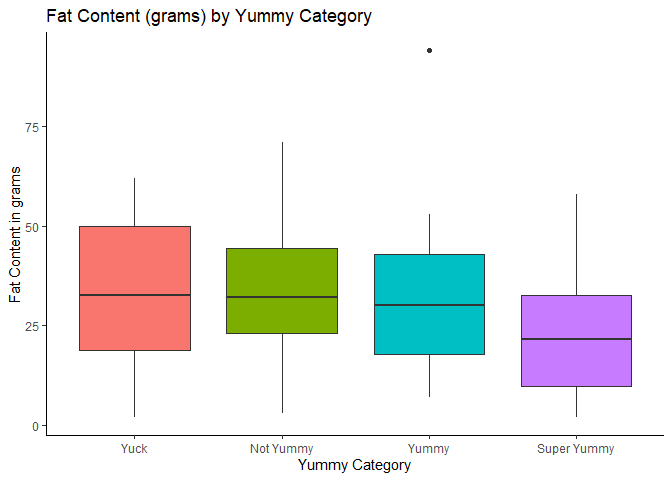
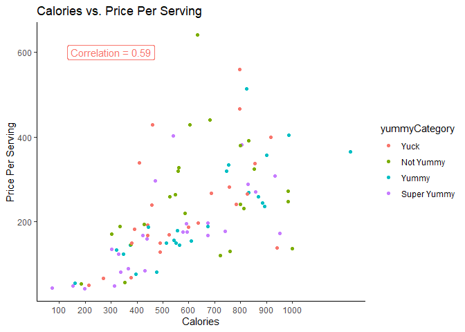

ST558: Project 1
================
Michael Bradshaw
2023-06-23

### Spoonacular API - To examine the relationships between ingredients, recipes, and nutrition

Let’s begin by communicating with the Spoonacular API (Application
Programming Interface) for food recipes. The URL for accessing the API
is below and functions for requesting different parts of recipe
information are provided.

To access more recipe data from the API, I wrote functions to pull from
different endpoints to capture recipe information, taste information,
and nutrition information. To determine how to request query the
information, you need to read the
[Documentation](https://spoonacular.com/food-api/docs). My functions
allows users to pull recipes by query (keyword), cuisine (i.e. italian,
french, etc.), diet (i.e. vegan, paleo, etc.), the ability to include or
exclude certain ingredients, the maximum time it takes to make the
recipe, and the maximum number of recipes to return (1-100). If you do
not want to specify a certain parameter, you can set it to NULL.

``` r
# Function to query the Spoonacular API and find a set recipes that we want to explore:
getRecipes <- function(apiKey, query, cuisine, diet, includeIngredients, excludeIngredients, maxReadyTime, number) {
  base_url <- "https://api.spoonacular.com/recipes/complexSearch"
  
  # Create a list of query parameters
  query_params <- list(
    apiKey = apiKey,
    query = query,
    cuisine = cuisine,
    diet = diet,
    includeIngredients = includeIngredients,
    excludeIngredients = excludeIngredients,
    maxReadyTime = maxReadyTime,
    number = number
  )

  # Send the GET request to Spoonacular
  response <- GET(url = base_url, query = query_params)

  # Extract the response content and parse it into a data frame
  content <- content(response, "text")
  parsed_data <- fromJSON(content)
  
  # Return the parsed data frame
  return(parsed_data$results)
}

# From our set of recipes, pull key information for further analysis.
getRecipeById <- function(recipe_id) {
  # API endpoint URL
  url <- paste0("https://api.spoonacular.com/recipes/", recipe_id, "/information")
  
  # API request to pull recipe information
  response <- GET(url, query = list(apiKey = apiKey))
  
  # Parse the response data
  data <- content(response, as = "text")
  parsed_data <- fromJSON(data)
  
  # Return the parsed recipe data
  return(parsed_data)
}

# pull the taste scores for each recipe from our query
getRecipeTasteById <- function(recipe_id) {
  # API endpoint URL
  url <- paste0("https://api.spoonacular.com/recipes/", recipe_id, "/tasteWidget.json")
  
  # API request to taste scores
  response <- GET(url, query = list(apiKey = apiKey))
  
  # Parse the response data
  data <- content(response, as = "text")
  parsed_data <- fromJSON(data)
  
  # Return the parsed taste data
  return(parsed_data)
}

#Get Nutrition Information for each recipe from our query
getRecipeNutritionById <- function(recipe_id) {
  # API endpoint URL
  url <- paste0("https://api.spoonacular.com/recipes/", recipe_id, "/nutritionWidget.json")
  
  # API request to get nutrition info
  response <- GET(url, query = list(apiKey = apiKey))
  
  # Parse the response data
  data <- content(response, as = "text")
  parsed_data <- fromJSON(data)
  
  # Return the parsed nutrition data
  return(parsed_data)
}
```

### This code pulls the recipe ID’s for the specified search parameters. Here we are pulling up to 100 pasta recipes that have cheese as an ingredient, do not contain tomatoes, and are ready in 45 minutes!

``` r
# Pulling pasta recipes with cheese and without tomato that are ready in 45 minutes
apiKey <- "6495f41712b644cebe48728831b9d5b1"
query <- "pasta"
cuisine <- NULL
diet <- NULL
includeIngredients <- "cheese"
excludeIngredients <- "tomato"
maxReadyTime <- 45
number <- 100

# Pulling the relevant recipes based on our search: here we set query, includeIngredients, maxReadyTime, and number - all others to NULL
recipes <- getRecipes(apiKey, query, cuisine, diet, includeIngredients, excludeIngredients, maxReadyTime, number)
```

### Next, we want to take the recipes from our search parameters and use their recipe ID’s to pull additional information from other parts of the API. This includes pulling 1) recipe information, 2) taste information, and 3) nutrition information. We iterate over each recipeID and create a new data frame with this information for each of recipes from our search query. The resulting dataframe contains 1 row per recipe, with columns containing information about the recipe.

``` r
# Next step: - create data frame from our recipes of interest
# pull together the data
recipe_df1 <- data.frame()

# Iterate over each recipe ID and pull information from different endpoints 
for (recipe_id in recipes$id) {
  # Retrieve recipe information for the current recipe ID
  recipe_data <- getRecipeById(recipe_id)
  
  # Retrieve taste information for the current recipe ID
  taste_info <- getRecipeTasteById(recipe_id)
  
  # Retrieve nutrition information for the current recipe ID
  nutrition_info <- getRecipeNutritionById(recipe_id)
  
    # Extract non-list objects from the recipe information and add them to the data frame
    recipe_info <- list(
      id = recipe_data$id,
      title = recipe_data$title,
      vegetarian = recipe_data$vegetarian,
      vegan = recipe_data$vegan,
      glutenFree = recipe_data$glutenFree,
      dairyFree = recipe_data$dairyFree,
      veryHealthy = recipe_data$veryHealthy,
      cheap = recipe_data$cheap,
      veryPopular = recipe_data$veryPopular,
      sustainable = recipe_data$sustainable,
      preparationMinutes = recipe_data$preparationMinutes,
      cookingMinutes = recipe_data$cookingMinutes,
      healthScore = recipe_data$healthScore,
      pricePerServing = recipe_data$pricePerServing,
      servings = recipe_data$servings,
      readyInMinutes = recipe_data$readyInMinutes,
      sourceUrl = recipe_data$sourceUrl,
      sweetness = taste_info$sweetness,
      saltiness = taste_info$saltiness,
      sourness = taste_info$sourness,
      bitterness = taste_info$bitterness,
      savoriness = taste_info$savoriness,
      fattiness = taste_info$fattiness,
      spiciness = taste_info$spiciness,
      calories = nutrition_info$calories,
      carbs = nutrition_info$carbs,
      fat = nutrition_info$fat,
      protein = nutrition_info$protein,
      query = query,
      # record each cuisine associated with a recipe
      cuisine = paste(unlist(recipe_data$cuisines), collapse = ", "), 
      # record each diet associated with a recipe
      diet = paste(unlist(recipe_data$diets), collapse = ", "), 
      maxReadyTime = maxReadyTime
    )
    # Append each recipe from our query into a resulting data frame
    recipe_df1 <- rbind(recipe_df1, recipe_info)
}
```

### Next we want to create new variables including 1) an indicator variable to identify if the recipe is expensive, 2) an indicator variable to identify if the variable has a high health score, 3) a overall taste score called yummyScore, which combines the sweetness and savoriness scores, while subtracting the bitterness score, and 4) categorizing the yummyScore variable into four categories based on quartiles of their yummyScore.

``` r
# Now lets create some new variables 
recipe_df1 <- recipe_df1 %>% mutate(expensive = ifelse(pricePerServing > quantile(pricePerServing, 0.75), 
                                                       "Yes", "No"),
                                     highHealthScore = ifelse(healthScore > quantile(healthScore, 0.75), 
                                                              "Yes", "No"),
                                     yummyScore = (sweetness + savoriness - bitterness),
                                     yummyCategory = cut(yummyScore, breaks = 
                                                        quantile(yummyScore, probs = c(0, 0.25, 0.5, 0.75, 1)),
                                     labels = c("Yuck", "Not Yummy", "Yummy", "Super Yummy"),
                                     include.lowest = TRUE))
```

### Next, lets create some contingency tables to examine some of our categorical variables:

    1. First we'll look at a contingency table of expensive recipes by vegetarian recipes.  
    2. Second, we'll look at a contingency table of yummy score categories by healthy recipes.
    3. Third, we'll look at a contingency table of gluten free recipes by very healthy recipes.

``` r
# Create some contingency tables:

#1st table: Expensive vs. Vegetarian
contingency_table1 <- table(recipe_df1$expensive, recipe_df1$vegetarian)
colnames(contingency_table1) <- c("Not Vegetarian", "Vegetarian")
rownames(contingency_table1) <- c("Not Expensive", "Expensive")
contingency_table1
```

    ##                
    ##                 Not Vegetarian Vegetarian
    ##   Not Expensive             67          5
    ##   Expensive                 22          2

In the first table, we see that in the “Not Vegetarian” category, there
are 67 recipes classified as not vegetarian and not expensive.
Additionally, there are 22 recipes classified as not vegetarian and
considered to be expensive. On the other hand, in the “Vegetarian”
category, there are only 5 recipes classified as vegetarian and
considered to be not expensive, while there are 2 recipes classified as
vegetarian and considered to be expensive. This table shows the lack of
vegetarian options available in our data.

``` r
#2nd table: Yummy Score Category by high Health Score
contingency_table2 <- table(recipe_df1$yummyCategory, recipe_df1$highHealthScore)
colnames(contingency_table2) <- c("Not Healthy", "Healthy")
contingency_table2
```

    ##              
    ##               Not Healthy Healthy
    ##   Yuck                 18       6
    ##   Not Yummy            19       5
    ##   Yummy                15       9
    ##   Super Yummy          20       4

In table 2, we observe a relatively even distribution of healthy vs non
healthy recipes across the yummy categories. At the high end, we observe
a slight wobble with this pattern where we observe there might be a
tendency to associate super yummy recipes with a lower level of
healthiness.

``` r
# 3rd table: gluten Free by very Healthy
contingency_table3 <- table(recipe_df1$glutenFree, recipe_df1$veryHealthy)
colnames(contingency_table3) <- c("Not Very Healthy", "Very Healthy")
rownames(contingency_table3) <- c("Not Gluten Free", "Gluten Free")
contingency_table3
```

    ##                  
    ##                   Not Very Healthy Very Healthy
    ##   Not Gluten Free               86            5
    ##   Gluten Free                    4            1

In table 3, we observe that most of the recipes selected are not gluten
free and not very healthy (n=86). This makes sense as most pastas are
not gluten free. We can also note that 90 of our 96 recipes are not very
healthy. Lastly, there are only five recipes that are not gluten free
and very healthy. Of the 5 gluten free recipes, 4 are not very healthy
and 1 is very healthy.

### Next, we create numerical summaries for some quantitative variables at each setting of some of categorical variables

``` r
# Summary 1:  pricePerServing by expensive categories:
recipe_df1 %>%
  group_by(expensive) %>%
  summarize(n_recipes = n(),
            mean_price = mean(pricePerServing),
            median_price = median(pricePerServing),
            min_price = min(pricePerServing),
            max_price = max(pricePerServing))
```

    ## # A tibble: 2 × 6
    ##   expensive n_recipes mean_price median_price min_price max_price
    ##   <chr>         <int>      <dbl>        <dbl>     <dbl>     <dbl>
    ## 1 No               72       165.         168.      42.9      289.
    ## 2 Yes              24       395.         382.     296.       641.

As expected, there is a notable difference in the average and median
prices between the “Not Expensive” and “Expensive” categories. The mean
and median prices for “Expensive” recipes are 395 and 382 respectively,
compared to 165 and 168 for “Not Expensive” recipes.

``` r
# Summary 2:  Number of calories by Yummy Categories
recipe_df1 %>% 
  mutate(calories = as.numeric(calories)) %>%
  group_by(yummyCategory) %>%
  summarize(n_recipes = n(),
            mean_calories = mean(calories),
            median_calories = median(calories),
            min_calories = min(calories),
            max_calories = max(calories))
```

    ## # A tibble: 4 × 6
    ##   yummyCategory n_recipes mean_calories median_calories min_calories max_calories
    ##   <fct>             <int>         <dbl>           <dbl>        <dbl>        <dbl>
    ## 1 Yuck                 24          581.            506.          213          942
    ## 2 Not Yummy            24          634.            618           184         1001
    ## 3 Yummy                24          644.            588.          161         1225
    ## 4 Super Yummy          24          525.            505            71          951

There is variation in the average, median, and range of calorie counts
across the different taste categories. Recipes categorized as “Yummy”
and “Not Yummy” have higher mean and median calorie counts compared to
the “Yuck” and “Super Yummy” categories. Additionally, the “Yummy”
category shows the greatest range of calorie counts, with higher maximum
values, compared to the other categories

``` r
# Summary 3: Health score by Vegetarian
recipe_df1 %>%
  group_by(vegetarian) %>%
  summarize(n_recipes = n(),
            mean_healthScore = mean(healthScore),
            median_healthScore = median(healthScore),
            min_healthScore = min(healthScore),
            max_healthScore = max(healthScore))
```

    ## # A tibble: 2 × 6
    ##   vegetarian n_recipes mean_healthScore median_healthScore min_healthScore max_healthScore
    ##   <lgl>          <int>            <dbl>              <int>           <int>           <int>
    ## 1 FALSE             89             23.1                 18               0             100
    ## 2 TRUE               7             33.3                 23               5              86

On average, Vegetarian recipes have higher mean health scores compared
to non-vegetarian recipes. However, we also see that non-vegetarian
meals can be healthy by looking at the maximum health score of 100.

``` r
# Summary 4: Ready in Minutes by Yummy Category
recipe_df1 %>%
  group_by(yummyCategory) %>%
  summarize(n_recipes = n(),
            mean_readyInMinutes = mean(readyInMinutes),
            median_readyInMinutes = median(readyInMinutes),
            min_readyInMinutes = min(readyInMinutes),
            max_readyInMinutes = max(readyInMinutes))
```

    ## # A tibble: 4 × 6
    ##   yummyCategory n_recipes mean_readyInMinutes median_readyInMinutes min_readyInMinutes max_readyInMinutes
    ##   <fct>             <int>               <dbl>                 <dbl>              <int>              <int>
    ## 1 Yuck                 24                44.8                    45                 40                 45
    ## 2 Not Yummy            24                41.9                    45                 15                 45
    ## 3 Yummy                24                42.1                    45                 25                 45
    ## 4 Super Yummy          24                40.4                    45                 20                 45

This table shows very little variation in the mean ready in minutes time
across the yummy categories. We note that most recipes seem to be ready
in 45 minutes by looking at the median scores of 45 and also noting that
the maximum from our search was 45 minutes.

``` r
# 1st plot: Histogram showing distribution of YummyScores
hist_plot <- ggplot(recipe_df1, aes(x = yummyScore)) +
  geom_histogram(fill = "blue", color = "white", bins=10) +
  labs(x = "Yummy Score", y = "Frequency", title = "Distribution of Yummy Scores 0-100") +
  theme_classic()

hist_plot
```

<!-- --> In this first
histogram, we see that the distribution of yummy scores has a relatively
normal distribution with values of scores ranging from -50 to 150.

``` r
# 2nd plot: Box plot showing Distribution of Health Scores by Expensive
box_plot1 <- ggplot(recipe_df1, aes(x = expensive, y = healthScore, fill = expensive)) +
  geom_boxplot() +
  labs(x = "Expensive", y = "Health Scores", title = "Health Scores by Expensive Category") +
  theme_classic()

box_plot1
```

<!-- --> In this first box plot,
we see that the mean health scores for expensive recipes are higher than
non-expensive recipes. We also observe a greater range in health scores
in the expensive recipes compared to non-expensive recipes. Finally, we
also notice that there appear to be multiple outliers in health scores
across the non-expensive recipe category, which may be inflating the
mean health scores for non-expensive recipes.

``` r
# 3rd plot: Bar plot of counts for high health score and yummy category
bar_plot1 <- ggplot(recipe_df1, aes(x = highHealthScore, fill = yummyCategory)) +
  geom_bar(position = "dodge") +
  labs(x = "High Health Score", y = "Count of Recipes", title = "Count of Recipes by Yummy Categories and High Health Score") +
  scale_fill_manual(values = c("lightblue", "lightpink", "lightgreen", "lightyellow")) +
  theme_light()

bar_plot1
```

<!-- -->

In this first bar plot, we note that there are fewer recipes with high
health scores. However, among each of our health score categories, there
is a relatively even distribution of yummy recipes across each health
score category.

At a granular level, super yummy recipes have a higher relative
frequency in non-high health score recipes compared to high health score
recipes. Additionally, yummy recipes have a lower relatively frequency
in non-high health score recipes compared to high health score recipes.

``` r
# 4th plot: Box plot of fat content by yummy category
recipe_df1$protein_num <- as.integer(gsub("g", "", recipe_df1$protein))
recipe_df1$fat_num <- as.integer(gsub("g", "", recipe_df1$fat))

box_plot2 <- ggplot(recipe_df1, aes(x = yummyCategory, y = fat_num, fill = yummyCategory)) +
  geom_boxplot() +
  labs(x = "Yummy Category", y = "Fat Content in grams", title = "Fat Content (grams) by Yummy Category") + guides(fill = "none") +
  theme_classic() 

box_plot2
```

<!-- -->

In this second box plot of fat content by yummy category, we observe
relatively similar fat contents among the yuck, not yummy, and yummy
categories (around 32 g per recipe on average). However, we can observe
that super yummy recipes have much lower fat contents, with an average
around 23 g per recipe. The yummy category appears to have one extreme
value of fat content that might be inflating the average substantially.

``` r
# 5th plot: Scatter plot showing calories by Price Per Serving
recipe_df1$pricePerServing <- as.numeric(recipe_df1$pricePerServing)
recipe_df1$calories <- as.numeric(recipe_df1$calories)

correlation <- cor(as.numeric(recipe_df1$calories), recipe_df1$pricePerServing)

scatter_plot <- ggplot(recipe_df1, aes(x = calories, y = pricePerServing, color=yummyCategory)) +
  geom_point() +
  scale_x_continuous(breaks = seq(0, 1000, 100))+
  labs(x = "Calories", y = "Price Per Serving", title = "Calories vs. Price Per Serving") +
  theme_classic()

scatter_plot +
  geom_label(x = 300, y = 600, size = 4, 
            label = paste0("Correlation = ", round(correlation, 2)), show.legend = FALSE)
```

<!-- -->

In this first scatter plot, we are comparing price per serving to the
number of calories in the recipe. We observe that there is a positive
correlation (r=0.59) between these variables, so as calories increase,
the price per serving also increases. The color of the dots indicate the
yummy category of the recipe, which appears relatively random and spread
out for this scatter plot comparison. So there is little to no
correlation between yummy category and the number of calories in the
recipe or the price per serving of the recipe.
